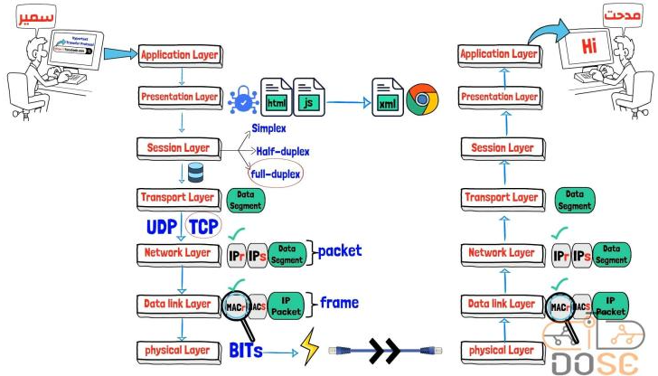
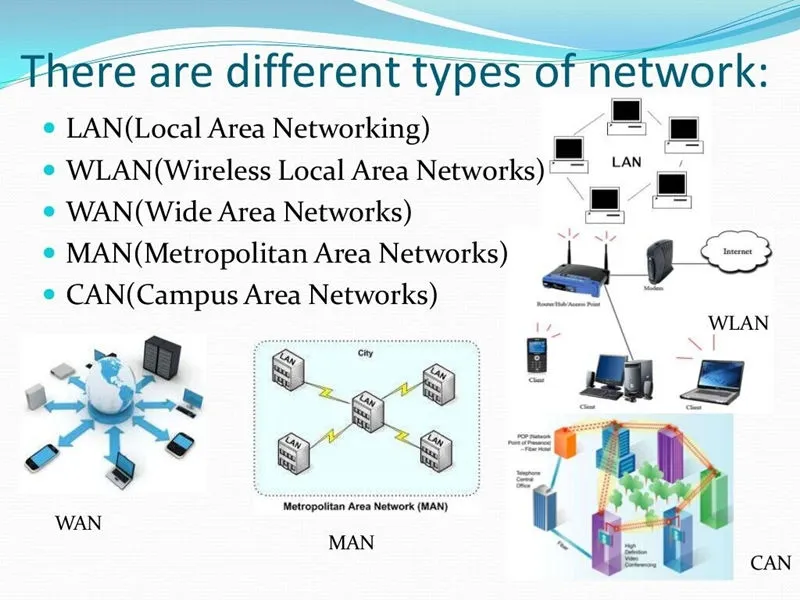
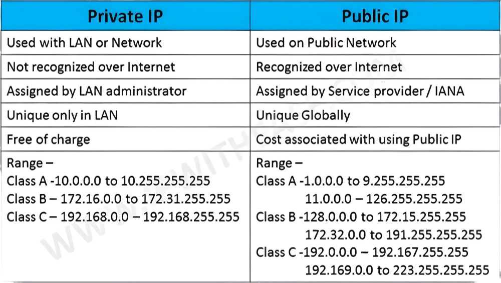
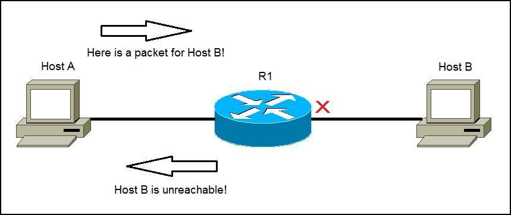

  <h1>Networking Fundamentals: From OSI Model to Ping 🚀🌐</h1>

Networking is the backbone of modern communication systems, enabling devices to establish connections, share data, and collaborate seamlessly. This comprehensive guide delves into essential networking concepts, ranging from the OSI model&#39;s layered structure to network protocols like ICMP, providing a deeper understanding of how data traverses various types of networks.

  

<h2>OSI Model: Layers of Communication 🏢</h2>

The <strong>OSI (Open Systems Interconnection)</strong> model serves as a conceptual blueprint for networking protocols to interact harmoniously. It comprises seven layers, each fulfilling a distinct role in the communication process:

<ol>
<li>
<strong>Physical Layer</strong>: The foundation of the OSI model, this layer deals with the actual transmission of raw bits over physical mediums such as cables, fibers, and radio waves. It defines the electrical and mechanical attributes of the connection.

</li>
<li>
<strong>Data Link Layer</strong>: Responsible for framing data into packets, error detection, and correction, this layer ensures reliable point-to-point communication between devices. It&#39;s here that MAC addresses are assigned to uniquely identify devices on the same network.

</li>
<li>
<strong>Network Layer</strong>: The network layer is where routing decisions are made. It employs logical addressing, using IP addresses, to determine the optimal path for data to reach its destination across different networks. Routers operate primarily at this layer.

</li>
<li>
<strong>Transport Layer</strong>: Operating end-to-end, the transport layer ensures reliable data delivery, whether using the connection-oriented TCP or the connectionless UDP. It segments and reassembles data, manages flow control, and handles error correction.

</li>
<li>
<strong>Session Layer</strong>: This layer manages session establishment, maintenance, and termination between applications on different devices. It ensures that data exchange is coordinated and organized.

</li>
<li>
<strong>Presentation Layer</strong>: Responsible for data translation, encryption, and compression, the presentation layer ensures that data sent by the application layer can be understood by the recipient&#39;s application.

</li>
<li>
<strong>Application Layer</strong>: The topmost layer provides interfaces and services directly to end-users. It includes various application protocols for tasks such as email (SMTP), file transfer (FTP), and web browsing (HTTP).

</li>
</ol>

 

<h2>Types of Networks: LAN, WAN, and Internet 🌍</h2>

<strong>Local Area Networks (LANs)</strong> are confined to a limited geographical area, such as a home, office, or campus. They utilize Ethernet cables or Wi-Fi to interconnect devices, fostering fast communication and resource sharing within the same vicinity.

<strong>Wide Area Networks (WANs)</strong> extend beyond LANs, connecting geographically separated networks. The <strong>Internet</strong>, the largest and most ubiquitous WAN, seamlessly interconnects millions of networks worldwide, enabling global communication and data exchange.

 

<h2>IP Addressing: Uniquely Identifying Devices 🔍</h2>

An <strong>IP (Internet Protocol)</strong> address serves as a digital identifier for devices on a network. It consists of a network portion and a host portion. This addressing scheme enables routers to route data to the correct destination across networks.

<ul>
<li>
<strong>Private IP Addresses</strong>: Reserved for use within a private network, these addresses are not routable on the public Internet. Examples include addresses in the ranges 192.168.0.0 to 192.168.255.255.

</li>
<li>
<strong>Public IP Addresses</strong>: These addresses are globally unique and allow devices to communicate across the Internet. Internet Service Providers (ISPs) assign public IP addresses to devices.

</li>
</ul>

 

 <h2>IPv4 and IPv6: Addressing Evolution 🔄</h2>

<strong>IPv4</strong> uses a 32-bit address format, allowing for approximately 4.3 billion unique addresses. Due to the explosive growth of connected devices, the introduction of <strong>IPv6</strong> became necessary. IPv6 employs a 128-bit address format, enabling a virtually limitless number of unique addresses.

<h2>MAC Address: Hardware Identifier 🖧</h2>

Every network interface controller (NIC) is assigned a <strong>MAC (Media Access Control)</strong> address. This 48-bit unique identifier is burned into the NIC&#39;s hardware and facilitates communication within the local network. It operates at the data link layer and is essential for devices to recognize each other on a LAN.

 

<h2>TCP and UDP: Reliable vs. Fast Communication 📊</h2>

<strong>Transmission Control Protocol (TCP)</strong> offers reliable, ordered, and error-checked data delivery. It ensures that data packets are received in the correct order and that missing or corrupted packets are retransmitted. This protocol is crucial for applications that demand data integrity, such as web browsing.

<strong>User Datagram Protocol (UDP)</strong> prioritizes speed over reliability. It lacks the mechanisms for retransmission and ordered delivery found in TCP, making it ideal for applications like real-time video streaming and online gaming.

 

 <h2>TCP/UDP Ports: Gateway to Applications 🚪</h2>

Ports play a pivotal role in network communication. They&#39;re used to differentiate between various services and applications on a single device. Ports are categorized into well-known, registered, and dynamic ranges. For example, HTTP typically uses port 80, while HTTPS uses port 443.

<h2>Command Line Operations 📝</h2>

Here are some essential networking commands that can be executed in the terminal:

<ul>
<li>
<strong>Display Network Information</strong>:

<ul>
<li>Windows: <code>ipconfig</code> - Display IP configuration for all network interfaces.</li>
<li>Linux/macOS: <code>ifconfig</code> - Display network interface configuration.</li>
<li><code>ip addr</code> - Display detailed IP address information.</li>
<li><code>netstat -i</code> - Display network interface statistics.</li>
</ul>
</li>
<li>
<strong>Display Routing Information</strong>:

<ul>
<li><code>netstat -r</code> - Display routing table.</li>
<li><code>ip route</code> - Display routing table (Linux/macOS).</li>
</ul>
</li>
<li>
<strong>Ping and Testing Connectivity</strong>:

<ul>
<li><code>ping &lt;ip_address&gt;</code> - Send ICMP echo requests to test network connectivity.</li>
<li><code>traceroute &lt;destination&gt;</code> - Trace the route packets take to reach a destination.</li>
</ul>
</li>
<li>
<strong>DNS Commands</strong>:

<ul>
<li><code>nslookup &lt;domain&gt;</code> - Perform DNS lookup for a domain name.</li>
<li><code>dig &lt;domain&gt;</code> - Domain Information Groper (Linux/macOS) for DNS lookups.</li>
<li><code>host &lt;domain&gt;</code> - Display domain name to IP address resolution.</li>
</ul>
</li>
<li>
<strong>Network Port Scanning</strong>:

<ul>
<li><code>nmap &lt;ip_address&gt;</code> - Network Mapper for scanning open ports on a target.</li>
<li><code>netstat -an</code> - Display all active network connections and their listening ports.</li>
</ul>
</li>
<li>
<strong>Network Interface Management</strong>:

<ul>
<li><code>ifconfig &lt;interface&gt; &lt;ip_address&gt;</code> - Configure IP address for a network interface.</li>
<li><code>ip link</code> - Manage network interfaces (Linux/macOS).</li>
</ul>
</li>
<li>
<strong>Network Diagnostic</strong>:

<ul>
<li><code>netdiag</code></li>
</ul>
</li>
<li>
Network Diagnostic Tool (Windows).

</li>
<li>
<code>mtr &lt;destination&gt;</code> - Combines <code>ping</code> and <code>traceroute</code> to provide network diagnostic information.

</li>
<li>
<strong>Network Services</strong>:

<ul>
<li><code>ssh &lt;username&gt;@&lt;ip_address&gt;</code> - Securely connect to a remote system using SSH.</li>
<li><code>telnet &lt;ip_address&gt; &lt;port&gt;</code> - Connect to a remote system using Telnet.</li>
<li><code>ftp &lt;ip_address&gt;</code> - Connect to an FTP server.</li>
<li><code>curl &lt;url&gt;</code> - Retrieve content from URLs using various protocols (HTTP, FTP, etc.).</li>
</ul>
</li>
<li>
<strong>Firewall and Security</strong>:

<ul>
<li><code>iptables</code> - Configure firewall rules (Linux).</li>
<li><code>ufw</code> - Uncomplicated Firewall management (Linux).</li>
<li><code>firewall-cmd</code> - Firewall configuration tool (Linux).</li>
<li><code>netsh advfirewall</code> - Configure Windows Firewall (Windows).</li>
</ul>
</li>
<li>
<strong>Network Traffic Capture and Analysis</strong>:

<ul>
<li><code>tcpdump</code> - Packet analyzer for network monitoring (Linux).</li>
<li><code>wireshark</code> - Graphical packet analyzer for capturing and analyzing network traffic.</li>
</ul>
</li>
</ul>

Remember that each command might have variations and options depending on the operating system you&#39;re using. Additionally, some commands might require administrative privileges, so make sure to run them accordingly.

Please be cautious while using network commands, especially those related to scanning and probing, as they can have legal and ethical implications. Always ensure you have the necessary authorization before using such tools.

 <h2>Ping and ICMP: Testing Network Connectivity 🚦</h2>

<strong>Ping</strong>, utilizing the <strong>ICMP (Internet Control Message Protocol)</strong>, is a versatile tool for testing network connectivity and diagnosing issues. When you send a ping request to an IP address, the target device responds with a reply. The round-trip time and success/failure of the response offer insights into network performance and potential problems.

 

<h2>Netstat: Network Statistics and Connections 📈</h2>

<strong>Netstat</strong> is a command-line utility that furnishes detailed information about network connections, routing tables, interface statistics, masquerade connections, and more. It&#39;s a valuable tool for diagnosing network issues and understanding the flow of data.

<h2>Conclusion 📚🎉</h2>

Mastering the intricacies of networking, from the hierarchical structure of the OSI model to the roles of IP addressing, diverse protocols, and vital utilities like ping and netstat, empowers individuals to comprehend the digital landscape&#39;s underlying framework. Whether within a confined LAN, spanning a WAN, or traversing the global Internet, these foundational elements collaboratively facilitate seamless communication and information sharing.

