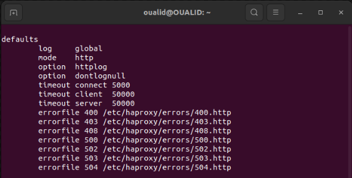

  <h1>✨HAProxy Load Balancing and HTTP Header Mastery✨</h1>

Load balancing is a crucial technique for high-traffic web servers to ensure high availability and maintain server performance during traffic spikes. HAProxy (Highly Available Proxy) is a popular, reliable, and cost-efficient solution for load balancing. This guide explains how to set up and use HAProxy for load balancing.

  

<h2 id="table-of-contents">Table of Contents</h2>
<ul>
<li><a href="#introduction">Introduction</a></li>
<li><a href="#what-is-haproxy">What is HAProxy?</a></li>
<li><a href="#setting-up-haproxy-for-load-balancing">Setting up HAProxy for Load Balancing</a></li>
<li><a href="#setting-initial-configuration">Setting Initial Configuration</a></li>
<li><a href="#setting-defaults">Setting Defaults</a></li>
<li><a href="#setting-frontend">Setting Frontend</a></li>
<li><a href="#setting-backend">Setting Backend</a></li>
<li><a href="#setting-rules">Setting Rules</a></li>
<li><a href="#monitoring">Monitoring</a></li>
<li><a href="#http-header">HTTP Header</a></li>
<li><a href="#conclusion">Conclusion</a></li>
</ul>
<h2>Introduction</h2>

High-traffic web servers benefit from implementing load balancers. A load balancer helps relay traffic across multiple web servers, ensuring high availability and maintaining web server performance during traffic spikes.

HAProxy is a popular, reliable, and cost-efficient solution for load balancing. The software is known for being robust and dependable. Many popular websites, such as GitHub, Reddit, Slack, and Twitter, use HAProxy for load-balancing needs.

<h2>What is HAProxy?</h2>

HAProxy (Highly Available Proxy) is an efficient web load balancer and reverse proxy server software written in C. This open-source software is available for most Linux distributions in popular package managers.

The tool has many complex functionalities, including a complete set of load balancing features.

As a load balancer, HAProxy works in two modes:

<ul>
<li>A TCP connection load balancer, where balancing decisions occur based on the complete connection.</li>
<li>An HTTP request balancer, where balancing decisions occur per request.</li>
</ul>

The sections below demonstrate how to create an HTTP load balancer.

<h2>Setting up HAProxy for Load Balancing</h2>

Install HAProxy on your system before setting up the load balancer. HAProxy is available in the yum and APT package manager repositories.

<h3>Installation on Ubuntu and Debian-based Systems</h3>

<ol>
<li>
Update the package list:

<pre><code class="language-bash">sudo apt update
</code></pre>

</li>
<li>
Install HAProxy with the following command:

<pre><code class="language-bash">sudo apt install haproxy
</code></pre>
</li>
</ol>

 
    

<h3>Installation on CentOS and RHEL-based Systems</h3>
<ol>
<li>
Update the yum repository list:

<pre><code class="language-bash">sudo yum update
</code></pre>
</li>
<li>
Install HAProxy with the following command:

<pre><code class="language-bash">sudo yum install haproxy
</code></pre>
</li>
</ol>

Wait for the installation to complete before proceeding.

<h2>Setting Initial Configuration</h2>

HAProxy provides a sample configuration file located in <code>/etc/haproxy/haproxy.cfg</code>. The file contains a standard setup without any load balancing options. Use a text editor to view the configuration file and inspect the contents:

<pre><code class="language-bash">sudo nano /etc/haproxy/haproxy.cfg
</code></pre>

The file has two main sections:

<ul>

<li>
The global section: Contains configuration for HAProxy, such as SSL locations, logging information, and the user and group that execute HAProxy functions. There is only one global in a configuration file, and the values should not be altered.

 
    

</li>
<li>
The defaults section: Sets the default values for all nodes defined below it. Multiple defaults sections are possible, and they override previous default values.

 
    

</li>
</ul>

Additional sections for load balancing include:

<ul>
<li>The frontend section: Contains information about the IP addresses and ports clients use to connect.</li>
<li>The backend section: Defines server pools that fulfill requests sent through the frontend.</li>
<li>The listen section: Combines the functions of the frontend and backend. Use listen for smaller setups or when routing to a specific server group.</li>
</ul>

A typical load balancer configuration file looks like the following:

<pre><code class="language-bash">global
    # process settings

defaults
    # default values for sections below

frontend
    # server the clients connect to

backend
    # servers for fulfilling client requests

listen
    # complete proxy definition
</code></pre>

Below is a detailed explanation of the sections and an example setup for a load balancing server with a custom configuration file. Clear all the contents from the default file and follow the example below.

<h2>Setting Defaults</h2>

The defaults section contains information shared across nodes defined below this section. Use defaults to define the operational mode and timeouts. For example:

<pre><code class="language-bash">defaults
    mode http
    timeout client 5s
    timeout connect 5s
    timeout server 5s
    timeout http-request 5s
</code></pre>

 
    

The code consists of:

<ul>
<li>
The <code>mode</code> section: A directive that defines the operating mode for the load balancer, set to either <code>http</code> or <code>tcp</code>. The mode tells HAProxy how to handle incoming requests.

</li>
<li>
The

</li>
</ul>

 <code>timeout</code> section: Consists of various safety measures for avoiding standard connection and data transfer problems. Increase or decrease the times according to your use case.

<ul>
<li><code>timeout client</code> is the time HAProxy waits for the client to send data.</li>
<li><code>timeout connect</code> is the time needed to establish a connection with the backend.</li>
<li><code>timeout server</code> is the wait time for the server to send data.</li>
<li><code>timeout http-request</code> is the wait time for the client to send a complete HTTP request.</li>
</ul>

Copy and paste the defaults code block into the <code>/etc/haproxy/haproxy.cfg</code> file and continue to the next section.

<h2>Setting Frontend</h2>

The frontend section exposes a website or application to the internet. The node accepts incoming connection requests and forwards them to a pool of servers in the backend.

Append the last two lines to the <code>/etc/haproxy/haproxy.cfg</code> file:

<pre><code class="language-bash">defaults
    mode http
    timeout client 10s
    timeout connect 5s
    timeout server 10s
    timeout http-request 10s

frontend my_frontend
    bind 127.0.0.1:80
</code></pre>

 
    

The new lines consist of the following information:

<ul>
<li>
<code>frontend</code> defines the section start and sets a descriptive name (<code>my_frontend</code>).

</li>
<li>
<code>bind</code> binds a listener to the localhost <code>127.0.0.1</code> address on port <code>80</code>, which is the address where the load balancer receives requests.

</li>
</ul>

Save the file and restart the HAProxy service. Run:

<pre><code class="language-bash">sudo systemctl restart haproxy
</code></pre>

The connection listens for requests on <code>127.0.0.1:80</code>. To test, send a request using the <code>curl</code> command:

<pre><code class="language-bash">curl 127.0.0.1:80
</code></pre>

 
    

The response returns a <code>503</code> error, meaning there is no reply from the server. The response makes sense because the backend servers currently do not exist. The following step sets up the backend node.

<h2>Setting Backend</h2>

The backend is a pool of servers for fulfilling and resolving client requests. The section defines how the load balancer distributes the workload across multiple servers.

Append the backend information to the <code>/etc/haproxy/haproxy.cfg</code> file:

<pre><code class="language-bash">defaults
    mode http
    timeout client 10s
    timeout connect 5s
    timeout server 10s
    timeout http-request 10s

frontend my_frontend
    bind 127.0.0.1:80
    default_backend my_backend

backend my_backend
    balance leastconn
    server server1 127.0.0.1:8001
    server server2 127.0.0.1:8002
</code></pre>

 
    

Each line has the following information:

<ul>
<li>
<code>default_backend</code> in the frontend section establishes communication between the front and back.

</li>
<li>
<code>backend</code> contains a descriptive name (<code>my_backend</code>) for the server pool, which we use to connect with the frontend.

</li>
<li>
<code>balance</code> is the load balancing algorithm. If omitted, the algorithm defaults to round-robin.

</li>
<li>
<code>server</code> defines a new server on each line with a unique name, IP address, and port.

</li>
</ul>

To test, do the following:

<ol>
<li>Save the file and restart the HAProxy service:</li>
</ol>

<pre><code class="language-bash">sudo systemctl restart haproxy
</code></pre>
<ol start="2">
<li>Bind the backend ports to the address using Python to create web servers. Run the commands in two different terminal tabs:</li>
</ol>

<pre><code class="language-bash">python3 -m http.server 8001 --bind 127.0.0.1
</code></pre>

<pre><code class="language-bash">python3 -m http.server 8002 --bind 127.0.0.1
</code></pre>

 
    

<ol start="3">
<li>In a third terminal window, send a request to confirm the connection works:</li></ol>

<pre><code class="language-bash">curl 127.0.0.1</code></pre>

 
    

The server processes the request from the client and sends a response back. The output displays the contents of the directory where the server is running.

Check the terminal window of the running server to see the request.

 
    

The output shows the GET request with a response <code>200</code>.

<h2>Setting Rules</h2>

Additional rules help configure the load balancer to handle cases with exceptions. For example, if there are multiple backends to which we direct client requests, the rules help define when to use which backend.

An example setup looks like the following:

<pre><code class="language-bash">defaults
    mode http
    timeout client 10s
    timeout connect 5s
    timeout server 10s
    timeout http-request 10s

frontend my_frontend
    bind 127.0.0.1:81, 127.0.0.1:82, 127.0.0.1:83
    use_backend first if { dst_port = 81 }
    use_backend second if { dst_port = 82 }
    default_backend third

backend first
    server server1 127.0.0.1

:8001

backend second
    server server2 127.0.0.1:8002

backend third
    server server3 127.0.0.1:8003
</code></pre>

 
    

The code does the following:

<ul>
<li>
Binds the address to three ports (81, 82, and 83).

</li>
<li>
Sets a rule to use the first backend if the destination port is 81.

</li>
<li>
Adds another rule to use the second backend if the destination port is 82.

</li>
<li>
Defines a default backend (third) for all other cases.

</li>
</ul>

Use multiple backends and rules to forward traffic to different websites or apps.

<h2>Monitoring</h2>

Use the global and listen sections to monitor the health of all the nodes via a web application. A typical setup looks like the following:

<pre><code class="language-bash">global
    stats socket /run/haproxy/admin.sock mode 660 level admin

defaults
    mode http
    timeout client 10s
    timeout connect 5s
    timeout server 10s
    timeout http-request 10s

frontend my_frontend
    bind 127.0.0.1:80
    default_backend my_backend

backend my_backend
    balance leastconn
    server server1 127.0.0.1:8001
    server server2 127.0.0.1:8002

listen stats
    bind :8000
    stats enable
    stats uri /monitoring
    stats auth username:password
</code></pre>

 
    

New additions to the file include:

<ul>
<li>
The global section that enables the stats socket Runtime API. Connecting to the socket allows dynamic server monitoring through a built-in web application.

</li>
<li>
The listen section serves the monitoring page on port 8000 with the URI <code>/monitoring</code> and requires credentials to access the page.

</li>
</ul>

To access the monitoring page:

<ol>
<li>Save the configuration file and restart HAProxy:</li>
</ol>
<pre><code class="language-bash">sudo systemctl restart haproxy
</code></pre>
<ol start="2">
<li>
Open a web browser and enter <code>127.0.0.1:8000/monitoring</code> as a web page address.

</li>
<li>
The page brings up the login window. Enter the credentials provided in the <code>stats auth username:password</code> located in the listen section.

</li>
</ol>

 
    

The monitoring page displays, showing various statistics for individual nodes.

 
    

The statistics display detailed information for the frontend and backend sections, while the final table shows the general statistics for both.

<h2>HTTP Header</h2>

An HTTP header is a field of an HTTP request or response that passes additional context and metadata about the request or response. For example, a request message can use headers to indicate its preferred media formats, while a response can use headers to indicate the media format of the returned body. Headers are case-insensitive, begin at the start of a line, and are immediately followed by a &#39;:&#39; and a header-dependent value. The value finishes at the next CRLF or at the end of the message.

The HTTP and Fetch specifications refer to a number of header categories, including:

<ul>
<li>
Request header: Headers containing more information about the resource to be fetched or about the client itself.

</li>
<li>
Response header: Headers with additional information about the response, like its location or about the server itself (name, version, …).

</li>
<li>
Representation header: metadata about the resource in the message body (e.g. encoding, media type, etc.).

</li>
<li>
Fetch metadata request header: Headers with metadata about the resource in the message body (e.g. encoding, media type, etc.).

</li>
</ul>
<h3>A basic request with one header:</h3>
<pre><code class="language-bash">GET /example.html HTTP/1.1
Host: example.com
</code></pre>
<h3>Redirects have mandatory headers:</h3>
<pre><code class="language-bash">302 Found
Location: /NewPage.html
</code></pre>
<h3>A typical set of headers:</h3>
<pre><code class="language-bash">304 Not Modified
Access-Control-Allow-Origin: *
Age: 2318192
Cache-Control: public, max-age=315360000
Connection: keep-alive
Date: Mon, 18 Jul 2016 16:06:00 GMT
Server: Apache
Vary: Accept

-Encoding
Via: 1.1 3dc30c7222755f86e824b93feb8b5b8c.cloudfront.net (CloudFront)
X-Amz-Cf-Id: TOl0FEm6uI4fgLdrKJx0Vao5hpkKGZULYN2TWD2gAWLtr7vlNjTvZw==
X-Backend-Server: developer6.webapp.scl3.mozilla.com
X-Cache: Hit from cloudfront
X-Cache-Info: cached
</code></pre>

Note: Older versions of the specification referred to:

<ul>
<li>
General header: Headers applying to both requests and responses but with no relation to the data eventually transmitted in the body.

</li>
<li>
Entity header: Headers containing more information about the body of the entity, like its content length or its MIME-type (this is a superset of what are now referred to as the Representation metadata headers)

</li>
</ul>

This comprehensive guide covers setting up HAProxy for load balancing and provides an introduction to HTTP headers.

<h2>Conclusion</h2>

In conclusion, this comprehensive guide has taken you through the essential steps of setting up HAProxy for load balancing, providing a reliable and efficient solution for distributing traffic across multiple web servers. You've learned the fundamental concepts of HAProxy, including its modes of operation and various configuration sections.

Starting from the installation of HAProxy on your system, you've delved into creating a basic configuration file, setting up defaults, frontends, backends, and rules. You've also explored how to monitor the health of your load-balanced nodes through HAProxy's built-in web application.

Furthermore, this guide expanded its scope to include a brief explanation of HTTP headers. You now understand that HTTP headers play a crucial role in conveying additional context and metadata about HTTP requests and responses, enhancing the flexibility and functionality of web communication.

With this knowledge, you are well-equipped to implement HAProxy for load balancing and manipulate HTTP headers to customize your web server behavior as needed.

By following these instructions and gaining insights into load balancing and HTTP headers, you are better prepared to optimize the performance, reliability, and scalability of your web services. Whether you are managing a high-traffic website or a complex web application, HAProxy and HTTP headers are valuable tools in your arsenal for a seamless and efficient web experience.
