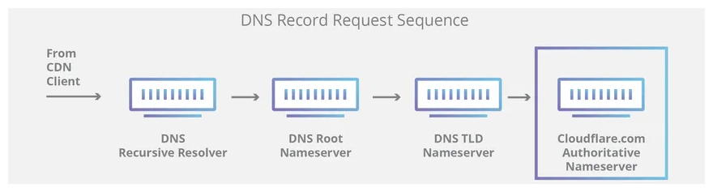

    <h1>Understanding the Web Request Process: From URL to ✨Webpage Display✨</h1>

When you type "https://www.google.com" into your web browser and hit Enter, you initiate a fascinating journey that involves various components working together to fetch and display the requested webpage. This comprehensive guide will unravel the intricacies of this process, explaining each step clearly and concisely while incorporating visual aids for an easier understanding.

<h2>Table of Contents:</h2>
  <ul>
    <li><a href="#dns-request">DNS Request</a></li>
    <li><a href="#tcp-ip">TCP/IP</a></li>
    <li><a href="#firewall">Firewall</a></li>
    <li><a href="#https-ssl">HTTPS/SSL</a></li>
    <li><a href="#load-balancer">Load Balancer</a></li>
    <li><a href="#database-of-the-internet">A Database of the Internet</a></li>
    <li><a href="#application-server">Application Server</a></li>
    <li><a href="#database">Database</a></li>
  </ul>

  <h2 id="dns-request">DNS Request:</h2>
  
The journey begins with a DNS (Domain Name System) request. DNS servers act as the internet's equivalent of a phone book, translating user-friendly domain names like "www.google.com" into the IP address necessary for your computer to locate the Google server on the internet.

  

  <h2 id="tcp-ip">TCP/IP:</h2>
  
Once the IP address is resolved, your computer establishes a connection using TCP/IP (Transmission Control Protocol/Internet Protocol), the foundation of internet communication. This ensures reliable data transmission between your device and the web server.

  

  <h2 id="firewall">Firewall:</h2>
  
Firewalls play a crucial role in the process by monitoring and filtering incoming and outgoing traffic. They act as a security barrier, safeguarding your computer against malicious connections and unauthorized access.

  

  <h2 id="https-ssl">HTTPS/SSL:</h2>
  
To secure the data exchange between your browser and the web server, HTTPS (Hypertext Transfer Protocol Secure) is employed, often in combination with SSL (Secure Sockets Layer) or its successor, TLS (Transport Layer Security). This encryption guarantees that your information remains confidential and protected from prying eyes.

  

  <h2 id="load-balancer">Load Balancer:</h2>
  
Many popular websites, including Google, use load balancers to distribute incoming traffic evenly across multiple servers. This not only improves website performance but also ensures reliability by preventing any single server from becoming overwhelmed with requests.

  

  <h2 id="database-of-the-internet">A Database of the Internet:</h2>
  
Search engines, like Google, maintain vast databases containing information about web pages. When you search for something, these databases are queried to return relevant results.

  

  <h2 id="application-server">Application Server:</h2>
  
The application server plays a pivotal role by running the software responsible for generating web pages dynamically. It retrieves data from databases and processes it to create the HTML, CSS, and JavaScript code that forms the webpage.

  

  <h2 id="database">Database:</h2>
  
Web applications frequently rely on databases to store and retrieve data, such as user information and content. Databases are crucial for managing and serving dynamic web content.

  

  <h2>Conclusion:</h2>
  
The journey of a web request, from typing a URL into your browser to loading a webpage, involves a complex interplay of various components, each with a unique role. Understanding this process is essential for those entering the field of web technology, networking, or cybersecurity. By visualizing each step in this journey, you now have a comprehensive overview of how the internet works, from DNS resolution to secure data transmission and web content retrieval.

  

  
By incorporating this guide into your Redmi profile, you can provide a valuable resource for individuals seeking a comprehensive understanding of web technology, whether they are newcomers to the field or aspiring to deepen their knowledge.

</body>
</html>
