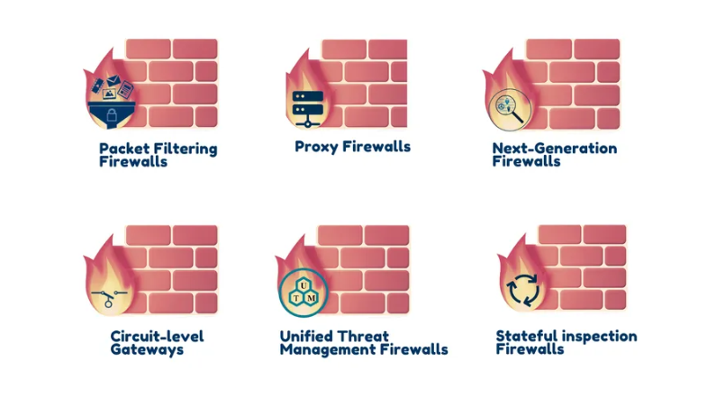
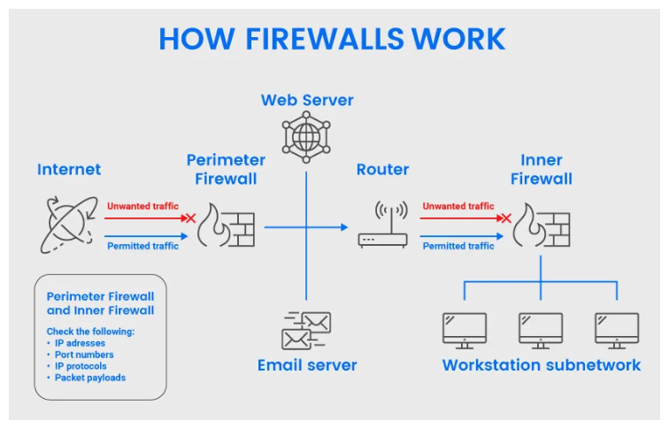
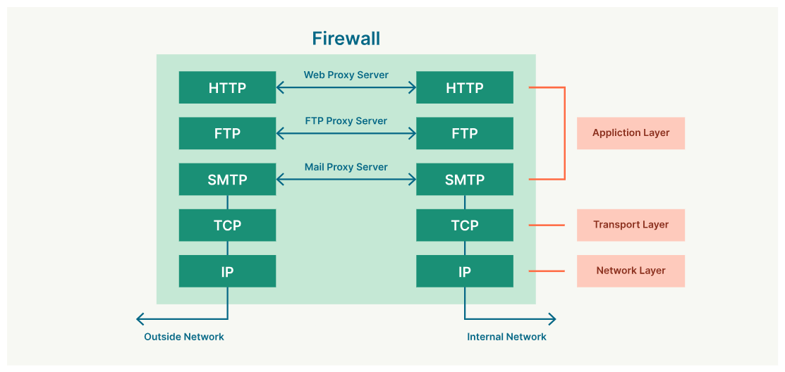
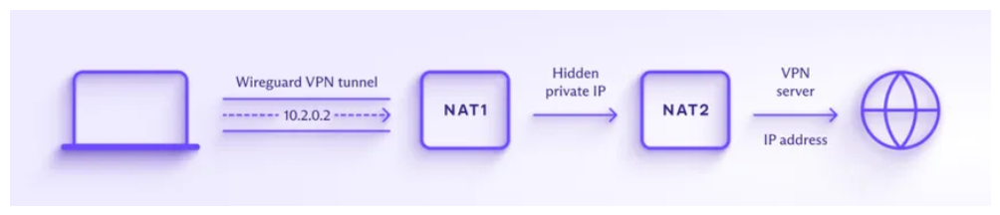

<h1>Mastering Firewalls: Types, Functionality, Benefits, and ✨Significance✨</h1>

  

<h2>Table of Contents</h2>
<ol>
<li><a href="#introduction">Introduction</a></li>
<li><a href="#types-of-firewalls">Types of Firewalls</a></li>
<li><a href="#how-does-a-firewall-work">How Does a Firewall Work</a></li>
<li><a href="#why-are-firewalls-important">Why Are Firewalls Important</a></li>
<li><a href="#key-uses-of-firewalls">Key Uses of Firewalls</a></li>
<li><a href="#functions-of-firewall">Functions of Firewall</a></li>
<li><a href="#advantages-of-using-firewalls">Advantages of Using Firewalls</a></li>
<li><a href="#how-to-use-firewall-protection">How to Use Firewall Protection</a></li>
<li><a href="#application-layer-and-proxy-firewalls">Application Layer and Proxy Firewalls</a></li>
<li><a href="#the-importance-of-nat-and-vpn">The Importance of NAT and VPN</a></li>
<li><a href="#next-generation-firewalls-ngfw">Next Generation Firewalls (NGFW)</a></li>
<li><a href="#the-future-of-network-security">The Future of Network Security</a></li>
<li><a href="#difference-between-a-firewall-and-antivirus">Difference Between a Firewall and Antivirus</a></li>
<li><a href="#limitations-of-a-firewall">Limitations of a Firewall</a></li>
<li><a href="#conclusion">Conclusion</a></li>
</ol>

<h2>Introduction</h2>

In the era of increasing cybercrimes, the security of personal and corporate data is of paramount importance. Firewalls are a crucial component in safeguarding networks and devices against external threats. This guide on &quot;What is a Firewall&quot; aims to provide a comprehensive understanding of firewalls and their role in protecting your network.

<h3>What Is a Firewall?</h3>

A firewall is a network security device designed to monitor and filter incoming and outgoing network traffic based on predefined security policies. It acts as a protective barrier between a private internal network and the public Internet, preventing unauthorized access and cyberattacks.

Firewalls are employed in both enterprise and personal settings, playing a vital role in network security. While most operating systems include basic built-in firewalls, the use of third-party firewall applications often offers enhanced protection.

<h2>Types of Firewalls</h2>

Firewalls can be categorized into software and hardware types, each with its own specific functions and use cases. Here are the different types of firewalls:

<ol>
<li>
<strong>Packet Filtering</strong>: Controls data flow based on packet attributes such as source and destination addresses, application protocols, and more.

</li>
<li>
<strong>Proxy Service Firewall</strong>: Protects networks by filtering messages at the application layer and serves as a gateway for specific applications.

</li>
<li>
<strong>Stateful Inspection</strong>: Permits or blocks network traffic based on state, port, and protocol, guided by administrator-defined rules and context.

</li>
<li>
<strong>Next-Generation Firewall (NGFW)</strong>: Incorporates deep-packet inspection, intrusion prevention, and advanced application-level inspection to enhance security.

</li>
<li>
<strong>Unified Threat Management (UTM) Firewall</strong>: Integrates stateful inspection, intrusion prevention, antivirus, and additional services in a user-friendly manner.

</li>
<li>
<strong>Threat-Focused NGFW</strong>: Offers advanced threat detection and mitigation, often employing network and endpoint event correlation.

</li>
</ol>

  

<h2>How Does a Firewall Work</h2>

A firewall acts as a gatekeeper for your network, allowing or blocking incoming traffic based on a set of rules. It discerns between trusted and malicious traffic, permitting or blocking specific data packets according to predefined security rules.

Firewalls operate by analyzing various packet attributes, such as source and destination addresses, content, and more. This enables them to block traffic from suspicious sources, thus preventing cyberattacks.

  

<h2>Why Are Firewalls Important</h2>

Firewalls play a pivotal role in modern security practices and have become indispensable for various applications. They inspect network traffic and mitigate threats to ensure the security of devices.

<h3>Key Uses of Firewalls</h3>
<ul>
<li><strong>Corporate and Consumer Settings</strong>: Firewalls are utilized in both corporate and consumer settings to guard against external and insider threats.</li>
<li><strong>Security Information and Event Management (SIEM)</strong>: Firewalls are integrated into modern organizations&#39; cybersecurity strategies and protect against external and insider threats.</li>
<li><strong>Logging and Audit Functions</strong>: Firewalls perform logging and audit functions, identifying patterns and improving rules to defend against immediate threats.</li>
<li><strong>Home Networks</strong>: Firewalls provide security for home networks, DSL, cable modems, and notify users of intrusions.</li>
<li><strong>Antivirus Applications</strong>: Firewalls are used in conjunction with antivirus applications to enhance security.</li>
<li><strong>Rule Updates</strong>: Firewalls are updated with new threat information and patches to address emerging security issues.</li>
<li><strong>Network Restriction</strong>: Hardware/firmware firewalls enable users to set restrictions for network access.</li>
</ul>

<h2>Functions of Firewall</h2>

The primary function of a firewall is to create a barrier between an external network and the protected network. It inspects all incoming and outgoing data packets and differentiates between benign and malicious packets based on pre-configured rules. Firewalls prevent unauthorized access and protect against cyber threats.

Firewalls read packet attributes such as source, destination, and content and apply corresponding rule sets to determine the protocol to use. This process ensures that only legitimate traffic enters the protected network.

<h2>Advantages of Using Firewalls</h2>

Understanding the advantages of firewalls is crucial for effective security management:

<ul>
<li><strong>Enhanced Security</strong>: Firewalls enhance security and privacy by preventing unauthorized access to the internet-connected private network.</li>
<li><strong>Fast Response Time</strong>: Firewalls provide quick response times and can handle high traffic loads.</li>
<li><strong>Centralized Security Management</strong>: Firewalls allow centralized security protocol management from a single authorized device.</li>
<li><strong>Phishing Protection</strong>: Firewalls safeguard networks from phishing attacks.</li>
</ul>

<h2>How to Use Firewall Protection</h2>

To ensure the security of your network and devices, it&#39;s essential to set up and maintain your firewall correctly. Here are some tips to enhance firewall security:

<ul>
<li><strong>Regular Updates</strong>: Keep your firewall updated with firmware patches to protect against newly discovered vulnerabilities.</li>
<li><strong>Antivirus Protection</strong>: Complement your firewall with antivirus software to safeguard your system from viruses and infections.</li>
<li><strong>Access Control</strong>: Limit inbound and outbound connections to trusted IP addresses using a strict whitelist.</li>
<li><strong>Active Network</strong>: Implement active network redundancies to prevent downtime and back up critical data in case of disasters.</li>
</ul>

<h2>Application Layer and Proxy Firewalls</h2>

Proxy firewalls offer protection at the application layer by filtering and examining packet payloads to distinguish between valid requests and potentially malicious code. These firewalls prevent application layer attacks and offer granular control over network traffic.

Application layer filtering by proxy firewalls can block malware and identify misuse across various protocols, including HTTP, FTP, specific applications, and DNS.

  

<h2>The Importance of NAT and VPN</h2>

Network Address Translation (NAT) and Virtual Private Networks (VPN) are fundamental functions in firewalls.

<strong>NAT (Network Address Translation)</strong>:

<ul>
<li>Hides or translates internal client or server IP addresses in private address ranges.</li>
<li>Preserves the limited number of IPv4 addresses and defends against network reconnaissance.</li>
</ul>

<strong>VPN (Virtual Private Network)</strong>:

<ul>
<li>Extends a private network securely across a public network, often encrypting data within the tunnel.</li>
<li>Ensures secure transmission of data across shared or public networks.</li>
</ul>

  

<h2>Next Generation Firewalls (NGFW)</h2>

Next-Generation Firewalls inspect packets at the application level of the TCP/IP stack, allowing them to identify specific applications and enforce security policies. NGFWs also include sandboxing and threat prevention technologies to detect and prevent malware and threats

 effectively.

<h2>The Future of Network Security</h2>

In recent years, advancements in virtualization and changes in data center architectures have led to increased east-west traffic. This shift has prompted some experts to reconsider the role of firewalls in ensuring network security. As enterprise organizations transition from traditional three-layer data center architectures to more agile leaf-spine architectures, firewalls continue to play a crucial role in maintaining a secure network environment. While the future of network security may introduce advanced alternatives to firewalls, the importance of firewalls remains undiminished.

<h2>Difference Between a Firewall and Antivirus</h2>

When it comes to cybersecurity protection, it&#39;s common to wonder about the differences between an antivirus and a firewall. The following comparison chart provides a clear overview of the distinctions between these two essential security tools:

<table>
<thead>
<tr>
<th>Basis for contrast</th>
<th>Antivirus</th>
<th>Firewall</th>
</tr>
</thead>
<tbody><tr>
<td>Implementation</td>
<td>Typically software-based</td>
<td>Can be both software and hardware-based</td>
</tr>
<tr>
<td>Performing operations</td>
<td>Scans for corrupt files and software</td>
<td>Monitors and filters network traffic, with emphasis on IP filtering</td>
</tr>
<tr>
<td>Concerns</td>
<td>Addresses internal and external threats</td>
<td>Primarily focused on external threats</td>
</tr>
<tr>
<td>Counterattacks</td>
<td>Does not facilitate counterattacks</td>
<td>Can defend against IP spoofing and routing attacks</td>
</tr>
<tr>
<td>Basis of Attack Inspection</td>
<td>Inspects malicious software on the computer</td>
<td>Inspects incoming network packets</td>
</tr>
</tbody></table>

<h2>Limitations of a Firewall</h2>

It&#39;s important to be aware of the limitations of firewalls:

<ul>
<li>Inability to prevent users from accessing malicious websites.</li>
<li>Limited protection against virus-infected files or misconfigured security rules.</li>
<li>Ineffectiveness against non-technical security risks such as social engineering.</li>
<li>Inability to prevent misuse of passwords or modem-based attacks on the internal network.</li>
<li>Lack of protection for already infected systems.</li>
</ul>

  

<h2>Conclusion</h2>

This comprehensive guide has provided you with an in-depth understanding of firewalls, their types, functions, advantages, and limitations. Cybersecurity is an ever-evolving field, and the role of firewalls in safeguarding networks remains critical. While there may be advanced alternatives in the future, firewalls continue to be a cornerstone of network security.

